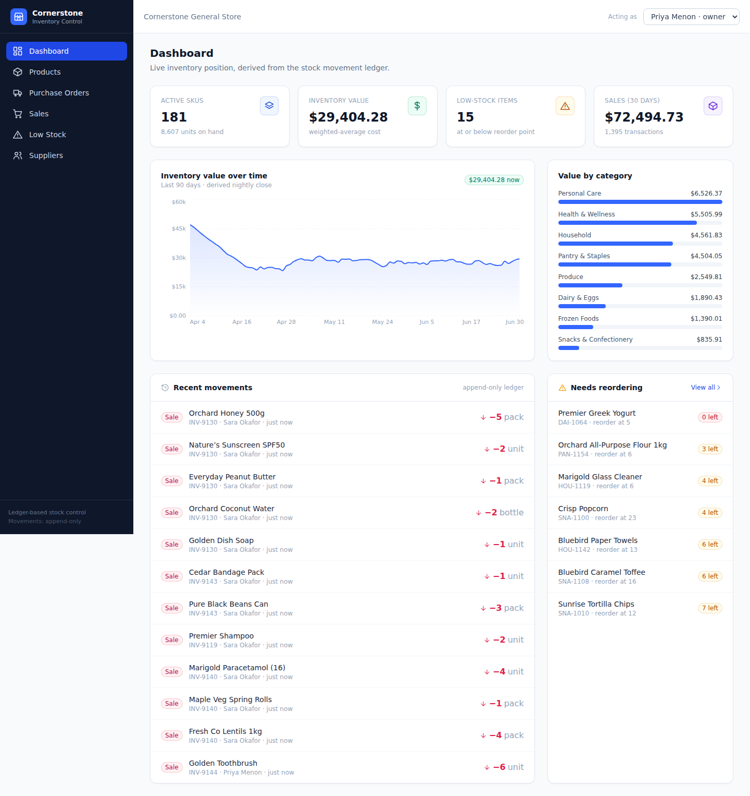

# Cornerstone — Inventory Management

A production-quality inventory management application for small retail businesses,
built around an **immutable stock-movement ledger**. Stock is never stored as a
mutable number — every quantity, valuation and low-stock flag is *derived* by
replaying an append-only ledger, exactly like double-entry accounting applied to
stock.



---

## The core architectural rule

> **Stock quantity is never stored.** There is no `quantity_on_hand` column
> anywhere in the schema. Every change to inventory is an immutable row in
> `stock_movements`. Quantity-on-hand, inventory value and reorder flags are
> computed on read.

Where to look:

| Concern | File |
| --- | --- |
| The ledger schema (and the deliberate *absence* of a quantity column) | [`server/src/db/schema.sql`](server/src/db/schema.sql) |
| **Deriving** quantity, weighted-average cost & valuation from the ledger | [`server/src/services/ledger.ts`](server/src/services/ledger.ts) |
| The **only** writer of movements (append-only, with the oversell guard) | [`server/src/services/movements.ts`](server/src/services/movements.ts) |

A movement is `(product, type, direction IN/OUT, positive quantity, unit_cost,
reason, reference_doc, user, timestamp)`. It is inserted, never updated or
deleted — a correction is itself a new `ADJUSTMENT` movement.

### Derived values

- **Quantity-on-hand** = Σ(IN) − Σ(OUT) over a product's movements.
- **Inventory valuation** uses the **weighted-average (moving-average) cost**
  method, recomputed as inbound movements arrive.
- **Low-stock flag** = quantity-on-hand ≤ reorder point.

---

## Tech stack

- **Frontend:** React + TypeScript + Vite + Tailwind CSS, Recharts for the
  stock-value chart. Data-dense tables, modals, toasts, loading/empty states.
- **Backend:** Node.js + Express + TypeScript. Thin, raw-SQL data layer so the
  ledger logic stays explicit and easy to point at.
- **Database:** SQLite via Node's **built-in `node:sqlite`** module — embedded,
  zero-config, and **no native build step** (nothing to compile, so `npm install`
  works on Windows/macOS/Linux without a C++ toolchain). Every table is
  `tenant_id`-scoped (multi-tenant data model).

### Requirements

- **Node.js 22.5+** (Node 22 LTS or 24 both work). The app uses the built-in
  `node:sqlite` module, so no database server and no compiler are needed.

---

## Getting started

```bash
# 1. Install dependencies (root workspaces: server + client)
npm install

# 2. Seed ~180 products, 9 suppliers and ~3 months of ledger history
npm run seed

# 3. Run API (:4000) and client dev server (:5173) together
npm run dev
```

Then open **http://localhost:5173**.

### Production-style single deployable

```bash
npm run build      # builds the client, then compiles the server
npm start          # serves the API + built client on http://localhost:4000
```

---

## Daily-use workflows

- **Receive stock** — create a purchase order, then *receive* it. Receiving
  appends a `PURCHASE_RECEIPT` (IN) movement per line; stock rises only when the
  ledger is written.
- **Sell / issue stock** — record a sale; each line appends a `SALE` (OUT)
  movement. Selling below available stock is **blocked with a warning** and can
  only proceed via an explicit "Sell anyway" confirmation (recorded faithfully).
- **Live stock levels** — the Products table shows derived quantity, weighted-
  average cost, stock value and a low-stock badge per SKU.
- **Low-stock alerts** — a dashboard panel and a dedicated page list every active
  product at or below its reorder point, with suggested order quantities.
- **Stock adjustment** — manual correction (damage, recount) that appends an
  `ADJUSTMENT` movement with a **mandatory reason**.
- **Product movement history** — every product page shows its full append-only
  ledger as an audit trail (who, what, when, reference, reason, unit cost).

The **Dashboard** is the landing screen: total active SKUs, total inventory
value, low-stock count, 30-day sales, a value-by-category breakdown, a recent-
movements feed, and a 90-day stock-value-over-time chart.

---

## Data model

```
tenants ─┬─ users            (owner / staff)
         ├─ suppliers
         ├─ products              (master data only — NO quantity)
         ├─ stock_movements       ◀── the append-only ledger (the heart)
         ├─ purchase_orders ── purchase_order_lines   (receiving → PURCHASE_RECEIPT)
         └─ sales ──────────── sale_lines             (recording → SALE)
```

Out of scope by design (not built): GST invoicing, HSN/e-way bills, accounting,
barcode scanning, multi-warehouse transfers, batch/expiry tracking, payments.

---

## Project layout

```
server/
  src/
    db/
      schema.sql        # ledger-centric schema (no stored quantity)
      index.ts          # connection + migrate
      seed.ts           # ~180 products, 9 suppliers, ~3 months of history
    services/
      ledger.ts         # derive qty / weighted-avg cost / valuation / series
      movements.ts      # append-only writer + oversell guard
    routes/             # products, suppliers, purchase-orders, sales, dashboard
    index.ts            # Express app (also serves the built client)
client/
  src/
    pages/              # Dashboard, Products, ProductDetail, PurchaseOrders, Sales, …
    components/         # Layout, UI primitives, movement badges, toasts
    lib/                # typed API client, hooks, formatters
```
